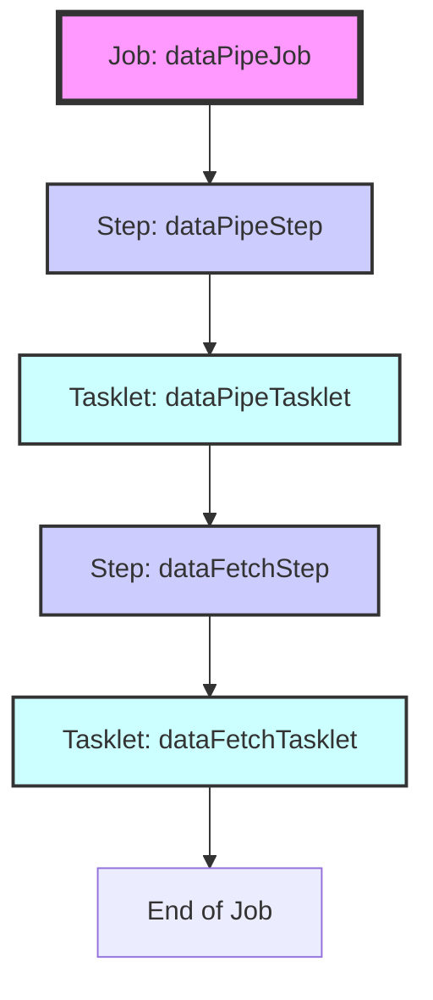
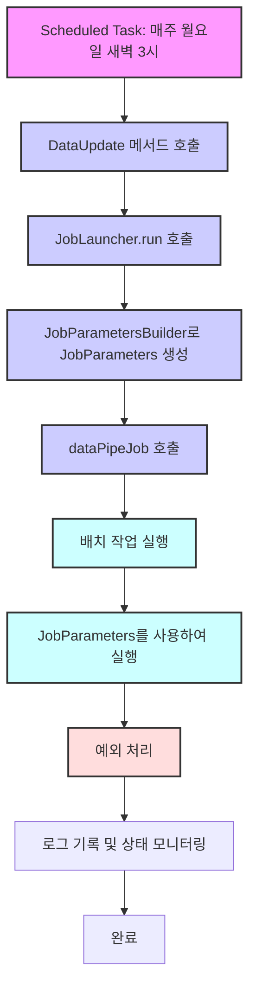

<div align="center">

# Yellow-Ribbon

### ✨ Backend TechStack ✨


### 🍀 서비스 개요 🍀
본 서비스는 공공데이터를 활용하여, 지역 음식점 목록을 자동으로 업데이트 하고 이를 활용합니다. </br>
사용자 위치 또는 지정한 위치 기반으로 맛집 및 메뉴를 추천하여 다양한 음식 경험을 제공하려 합니다.
</div>

</br>

### 🙋‍♀️ 팀원
| 이름 | Github | 담당 |
|------|--------|------|
| 김영주 | K-0joo | 회원 API 전반 |
| 정은경 | jeongeungyeong | 데이터 파이프라인 전반 |
| 이지원 | jw427 | 시군구 목록, 맛집 상세 정보, 맛집 평가 생성 API |
| 정진희 | rhaehf | 위치 기반 맛집 목록 조회 API |

## [목차]
- [📁 디렉토리 구조](#디렉토리-구조)
- [📦 ERD](#erd)
- [💌 API 명세서](#api-명세서)
- [✉ Git Commit Message Convention](#-git-commit-message-convention)
- [🌿 Git Branch 전략](#-git-branch-전략)

## 디렉토리 구조
<details>
<summary><strong>구조도</strong></summary>
<div markdown="1">
  
```
src
├─main
│  ├─generated
│  │  └─wanted
│  │      └─ribbon
│  │          ├─genrestrt
│  │          │  └─domain
│  │          │          QGenrestrt.java
│  │          │
│  │          ├─store
│  │          │  └─domain
│  │          │          QCity.java
│  │          │          QReview.java
│  │          │          QStore.java
│  │          │
│  │          └─user
│  │              └─domain
│  │                      QRefreshToken.java
│  │                      QUser.java
│  │
│  ├─java
│  │  └─wanted
│  │      └─ribbon
│  │          │  RibbonApplication.java
│  │          │
│  │          ├─exception
│  │          │  │  BadRequestException.java
│  │          │  │  BaseException.java
│  │          │  │  ConflictException.java
│  │          │  │  ErrorCode.java
│  │          │  │  ErrorResponse.java
│  │          │  │  ForbiddenException.java
│  │          │  │  GenrestrtException.java
│  │          │  │  InternalServerException.java
│  │          │  │  NotFoundException.java
│  │          │  │
│  │          │  └─handler
│  │          │          GlobalExceptionHandler.java
│  │          │
│  │          ├─genrestrt
│  │          │  ├─component
│  │          │  │      DataPipeTasklet.java
│  │          │  │
│  │          │  ├─config
│  │          │  │      AppConfig.java
│  │          │  │      DataPipeJobConfig.java
│  │          │  │
│  │          │  ├─controller
│  │          │  │      GenrestrtController.java
│  │          │  │
│  │          │  ├─domain
│  │          │  │      Genrestrt.java
│  │          │  │
│  │          │  ├─dto
│  │          │  │      GenrestrtApiResponse.java
│  │          │  │      RawData.java
│  │          │  │
│  │          │  ├─mapper
│  │          │  │      RawDataRowMapper.java
│  │          │  │
│  │          │  ├─repository
│  │          │  │      GenrestrtRepository.java
│  │          │  │
│  │          │  └─service
│  │          │          DataProcessor.java
│  │          │          GenrestrtService.java
│  │          │
│  │          ├─global
│  │          │  └─config
│  │          │          QueryDslConfig.java
│  │          │
│  │          ├─store
│  │          │  ├─controller
│  │          │  │      CityController.java
│  │          │  │      ReviewController.java
│  │          │  │      StoreController.java
│  │          │  │
│  │          │  ├─domain
│  │          │  │      Category.java
│  │          │  │      City.java
│  │          │  │      Review.java
│  │          │  │      Store.java
│  │          │  │
│  │          │  ├─dto
│  │          │  │      CityResponseDto.java
│  │          │  │      CreateReviewRequestDto.java
│  │          │  │      CreateReviewResponseDto.java
│  │          │  │      ReviewListResponseDto.java
│  │          │  │      StoreDetailResponseDto.java
│  │          │  │      StoreResponseDto.java
│  │          │  │
│  │          │  ├─repository
│  │          │  │      CityRepository.java
│  │          │  │      ReviewRepository.java
│  │          │  │      StoreRepository.java
│  │          │  │      StoreRepositoryCustom.java
│  │          │  │      StoreRepositoryImpl.java
│  │          │  │
│  │          │  └─service
│  │          │          CityService.java
│  │          │          ReviewService.java
│  │          │          StoreService.java
│  │          │
│  │          └─user
│  │              ├─config
│  │              │  │  TokenAuthenticationFilter.java
│  │              │  │  TokenProvider.java
│  │              │  │  WebSecurityConfig.java
│  │              │  │
│  │              │  └─jwt
│  │              │          JwtProperties.java
│  │              │
│  │              ├─controller
│  │              │      TokenApiController.java
│  │              │      UserApiController.java
│  │              │
│  │              ├─domain
│  │              │      RefreshToken.java
│  │              │      User.java
│  │              │
│  │              ├─dto
│  │              │      CreateAccessTokenRequest.java
│  │              │      CreateAccessTokenResponse.java
│  │              │      SignUpUserRequest.java
│  │              │      SignUpUserResponse.java
│  │              │      UpdateUserRequest.java
│  │              │      UserLoginRequestDto.java
│  │              │      UserLoginResponseDto.java
│  │              │
│  │              ├─repository
│  │              │      RefreshTokenRepository.java
│  │              │      UserRepository.java
│  │              │
│  │              └─service
│  │                      RefreshTokenService.java
│  │                      TokenService.java
│  │                      UserDetailService.java
│  │                      UserService.java
│  │
│  └─resources
│          application-secret.yml
│          application.yml
│
└─test
    └─java
        └─wanted
            └─ribbon
                    RibbonApplicationTests.java

```

</details>

## ERD

</br>

## API 명세서
</br>
<details>
<summary>유저</summary>
<div markdown="1">

### 🙋‍♀️ 사용자 회원 가입
#### 1. 설명
- `계정명`, `패스워드`를 입력하여 회원가입 합니다.
</br>

#### 2. 입력
- url
> `POST` http://localhost:8080/api/users/signup

- body
```
{
  "id": "계정명",
  "password": "비밀번호"
}
```

#### 3. 출력
- **Response : 성공 시**
```
{
    "message": "회원가입 성공",
    "userId": "계정 UUID",
    "id": "계정명"
}
```

</br>

### 🔍 사용자 로그인
#### 1. 설명
- `계정명`, `패스워드`로 로그인 시 JWT가 발급됩니다.
- 이후 모든 API 요청 Header에 JWT가 항시 포함되며, JWT 유효성을 검증합니다.

#### 2. 입력
- url
> `POST` http://localhost:8080/api/users/login

- body
```
{
  "id": "계정명",
  "password": "비밀번호"
}
```

#### 3. 출력
- **Response : 성공 시**
```
{
    "userId": "계정 UUID",
    "accessToken": "액세스 토큰 값",
    "refreshToken": "리프레쉬 토큰 값"
}
```

- **Response : 실패시**
- 존재하지 않는 아이디일 때
```
{
    "status": 404,
    "message": "존재하지 않는 엔티티입니다."
}
```


</br>


### ⭐ 사용자 설정 업데이트
#### 1. 설명
- 사용자의 위치인 `위도`, `경도`를 업데이트 합니다.
- `점심 추천 기능 사용 여부`를 업데이트 합니다.

#### 2. 입력
- url
> `PUT` http://localhost:8080/api/users/settings/{계정UUID}

- body
```
{
    "lat": 위도좌표값,
    "lon": 경도좌표값,
    "recommend": 점심추천기능사용여부
}
```

- Headers

|Key|Value|
|----|------|
|Authorization|Bearer {액세스 토큰 값}|

#### 3. 출력
- **Response : 성공 시**
```
{
    "message": "위도, 경도, 추천 여부 변경 완료",
    "userId": "계정 UUID",
    "lat": 위도좌표값,
    "lon": 경도좌표값,
    "recommend": 점심추천기능사용여부
}
```

</br>

### 📃 사용자 정보(API)
#### 1. 설명
- `패스워드`를 제외한 모든 사용자 정보를 반환합니다.
- 클라이언트에서 사용자 `위도`, `경도`, `점심 추천 기능 사용 여부`를 사용하기 위해서입니다.

#### 2. 입력
- url
> `GET` http://localhost:8080/api/users/profile/{계정UUID}


#### 3. 출력
- **Response : 성공 시**
```
{
    "message": "회원 조회 성공",
    "id": "계정명",
    "lat": 위도좌표값,
    "lon": 경도좌표값,
    "recommend": 점심추천기능사용여부
}
```

- **Response : 실패시**
```
{
    "status": 404,
    "message": "존재하지 않는 엔티티입니다."
}
```

</div>
</details>
</br>
<details>
<summary> 데이터 파이프라인 </summary>
<div>
</br>
<details>
<summary> 데이터 수집 과정 </summary>
<div markdown="1">

<div>

### 🛒 데이터 수집 과정
### 기능 요구사항
  - API가 아닌 별도 프로그래밍 된 프로세스입니다.
  
### 데이터 수집 과정
1. [공공데이터포털](https://www.data.go.kr/tcs/dss/selectDataSetList.do?dType=API&keyword=%EA%B2%BD%EA%B8%B0%EB%8F%84+%EC%9D%BC%EB%B0%98%EC%9D%8C%EC%8B%9D%EC%A0%90&operator=AND&detailKeyword=&publicDataPk=&recmSe=&detailText=&relatedKeyword=&commaNotInData=&commaAndData=&commaOrData=&must_not=&tabId=&dataSetCoreTf=&coreDataNm=&sort=_score&relRadio=&orgFullName=&orgFilter=&org=&orgSearch=&currentPage=1&perPage=10&brm=&instt=&svcType=&kwrdArray=&extsn=&coreDataNmArray=&pblonsipScopeCode=) 로 접속하여 연동할 Open API 규격을 확인합니다.
2. 경기도_일반음식점(xx) 에 해당하는 OpenAPI 중 3가지 이상 수집에 사용합니다.(한식, 중식, 일식,)
3.  Flowchart

	```mermaid 
	graph TD 
	A[API 호출 및 데이터 수신] --> B[JSON 형식 데이터를 DTO에 매핑] 
	B --> C[DTO 데이터 분석 및 추출] 
	C --> D[Genstrt 엔티티로 파싱] 
	D --> E[DB에 데이터 저장]
	```
### Issue
- #8 

### 프로세스 테스트
### Request
  ```java
HTTP : POST
URL: /api/genrestrts/fetch-data?serviceName=서비스이름
```
    
- Request Param
	- `serviceName`: 서비스이름


### Response : 성공시
```json
"serviceName가 db에 성공적으로 저장됐습니다."
```
 
### Response : 실패시
#### `400 Bad Request`
- 응답이 없을 때
- 응답 파싱 실패
#### `404 Not Found`
- 잘못된 `serviceName`을 입력했을 때
- OpenApi 데이터가 존재하지 않을 때
#### `500 Internal Server Error`
- 공공데이터 API 호출 오류

</div>

</div>
</details>

<details>
<summary> 데이터 전처리 및 저장 </summary>
<div markdown="1">

<div> 

### 💾 데이터 전처리 및 저장
### 기능 요구사항
  - 운영 테이블 형식에 맞춰 데이터를 가공합니다.
  - 원본 데이터에서 null 값은 디폴트 값으로 설정합니다.
	  - ex) `위도`, `경도`, `평점` = 0.0
	  - ex) `가게명`, `주소` = "정보 없음"
  - 식당 마다 하나의 데이터가(레코드) 존재해야하며, 정보들은 업데이트 되어야 합니다.
  - 현재 사업자는 사업장마다 내야하는 규칙에 따라 “ `가게명` + `주소(도로명 주소)` ”로 유일하게 유지합니다.

### 데이터 전처리 및 저장 과정 


### Issue
- #10 #12 

### 프로세스 테스트

### Job : 성공시
``` json
"Step: [dataPipeStep] executed 
Job: [SimpleJob: [name=dataPipeJob]] completed with the following parameters: [{}] and the following status: [COMPLETED] "
```
 
### Job: 실패시
-   데이터 처리 중 예외 발생 시 로그와 함께 "데이터 처리에 오류가 발생했습니다." 오류 메시지 출력
-   서버 에러로 처리
```
  "Step: [dataPipeStep] failed with exception: [NullPointerException]
    Job: [SimpleJob: [name=dataPipeJob]] failed with status: [FAILED] " 
```
</div>

</div>
</details>
<details>
<summary> 데이터 자동화 </summary>
<div markdown="1">

<div> 

### 🔁 데이터 자동화
### 기능 요구사항
  - `스케쥴러`를 설정하여 위 로직을 지정한 시간마다 실행시킵니다.
  - 매주 월요일 새벽 3시에 실행
 


### Issue
- #10 #12 

### 프로세스 테스트

### Scheduled: 성공시
``` json
"Job: [SimpleJob: [name=dataPipeJob]] launched with the following parameters: [{}]
Executing step: [dataPipeStep]
데이터 삽입 성공 및 처리 상태 업데이트: wanted.ribbon.store.domain.Store@3917c51d
페이지 처리 완료: {}개 행 처리됨
배치 작업 완료. 총 {}개의 행이 처리되었습니다.
Step: [dataPipeStep] executed in 161ms
Executing step: [dataFetchStep]
삭제된 맛집: 이름={}, 주소={}
정보가 바뀐 맛집의 수는: 0
정보가 지워진 맛집의 수는: 1
Step: [dataFetchStep] executed in 8s644ms
Job: [SimpleJob: [name=dataPipeJob]] completed with the following parameters: [{}] and the following status: [COMPLETED] in 9s639ms] "
```
 
### Scheduled: 실패시
-   데이터 처리 중 예외 발생 시 로그와 함께 "데이터 처리에 오류가 발생했습니다." 오류 메시지 출력
-   서버 에러로 처리
```
  "Step: [dataPipeStep] failed with exception: [NullPointerException]
  Step: [dataFetchStep] failed with exception: [NullPointerException]
  Job: [SimpleJob: [name=dataPipeJob]] failed with status: [FAILED] " 
```
</div>

</div>
</details>
</div>
</details>
</br>
<details>
<summary>시군구 목록</summary>
<div markdown="1">

<div> 

### 🗒️ 시군구 목록
### 기능 요구사항
  - 시군구 모든 목록을 반환한다.
  - `시도` , `시군구` 로 지역 조회 기능에 사용된다.
  
### API 처리 과정
1. DB에 있는 모든 시군구 목록을 조회한다.

### Issue
- #3 #19 

### API 테스트
### Request
  ```java
HTTP : GET
URL : /api/city
``` 

### Response : 성공시
```java
[
    {
        "doSi": "강원",
        "sgg": "강릉시"
    },
    {
        "doSi": "강원",
        "sgg": "고성군"
    },
    {
        "doSi": "강원",
        "sgg": "동해시"
    },
   ...
]
```

</div>

</div>
</details>

</br>
<details>
<summary>맛집 상세정보</summary>
<div markdown="1">

<div> 

### 📖 맛집 상세정보
### 기능 요구사항
  - `맛집 모든필드` 를 포함한다.
  - 해당 맛집의 `평가` 상세 리스트도 포함한다.
      - 모든 내역을 생성시간 역순(최신순) 으로 반환한다.
  
### API 처리 과정
1. `맛집 일련번호`로 맛집의 모든 필드와 해당 맛집의 모든 `평가` 리스트를 찾는다.
2. `평가` 리스트는 생성시간 역순인 `평가 일련번호` 내림차순으로 정렬한다.

### Issue
- #7 #19 

### API 테스트
### Request
  ```java
HTTP : GET
URL: /api/stores/:storeId
```
    
- Request Header
```java
Authorization: “Bearer XXXXXXXXX”
```

### Response : 성공시
```java
{
    "storeId": 맛집 일련번호,
    "sigun": 시군명,
    "storeName": 사업장명,
    "category": 위생업태명(분류),
    "address": 소재지도로명주소,
    "storeLat": 위도,
    "storeLon": 경도,
    "rating": 평점,
    "reviewList": [
        {
            "id": 계정명,
            "score": 평가 점수,
            "content": 평가 내용
        },
        ...
    ]
}
```
 
### Response : 실패시
- 잘못된 `storeId`를 입력했을 때
```java
{
    "status": 404,
    "message": "존재하지 않는 맛집입니다."
}        
```

</div>

</div>
</details>
</br>
<details>
<summary>맛집 평가 생성</summary>
<div markdown="1">

<div> 

### 📝 맛집 평가 생성
### 기능 요구사항
  - `유저` 가 특정 `맛집` 에 평가를 한다.
  - `평가` 가 생성되면, 해당 맛집의 `평점` 을 업데이트 한다.
  
### API 처리 과정
1. `Header`에 있는 `액세스 토큰`으로 `유저`를 찾고, `맛집 일련번호`로 해당 맛집을 찾는다.
2. 입력된 `평가 점수`, `평가 내용`와 함께 평가를 생성한다.
3. 평가가 생성되면 해당 맛집 모든 평가 기록을 조회해 평균을 계산하여 업데이트한다.

### Issue
- #14 #19 

### API 테스트
### Request
  ```java
HTTP : POST
URL: /api/reviews/:storeId
```
    
- Request Header
  ```java
Authorization: “Bearer XXXXXXXXX”
```

- Request body
  ```java
{
    "score": 점수,
    "content": 내용
}
```

### Response : 성공시
- `201 Created`
  ```java
{
    "id": 계정명,
    "score": 점수,
    "content": 내용
}
```
 
### Response : 실패시
- 잘못된 `storeId`를 입력했을 때
  ```java
{
    "status": 404,
    "message": "존재하지 않는 맛집입니다."
}        
```

</div>

</div>
</details>
</br>
<details>
<summary>위치 기반 맛집 목록 조회</summary>
<div markdown="1">

<div> 

### 🧭 위치 기반 맛집 목록 조회
### 기능 요구사항
  - 위도(lat), 경도(lon)로 설정된 사용자의 위치에서 주어진 범위(range) 만큼의 맛집 목록을 정렬 기준에 따라 정렬하여 반환한다.
  - 정렬 기준
	  요청시 기본 정렬 기준 : 거리순
    - 거리순(distance) : 사용자의 위치에서 가까운 가게부터 출력
    - 평점순(rating) : 범위 내의 가게 중에서 평점이 높은 가게부터 출력
  
### API 처리 과정
1. 주어진 위도, 경도(이하 사용자의 위치), 범위로 사각형 범위를 설정해서 맛집 목록을 조회한다.
  이 때 사용자의 위치와 맛집의 거리를 구해서 범위 이하인지 확인한다.
2. 정렬 기준에 따라서 맛집 목록을 반환한다.

### Issue
- #6 #21 

### API 테스트
### Request
  ```java
HTTP : GET
URL (거리순) : /api/stores?lat=37.3503950812&lon=127.1108000763&range=1
URL (평점순) : /api/stores?lat=37.3503950812&lon=127.1108000763&range=1&orderBy=rating
```

### Response : 성공시
1. 일치하는 데이터가 없을 때 - `204(No Content)` 반환
<details>
<summary>2. 거리순 - 200(OK) 반환</summary>
<div markdown="1">

```java
  {
    "totalCount": 2,
    "stores": [
        {
            "storeId": 1126,
            "sigun": "성남시",
            "storeName": "한솥도시락(미금점)",
            "category": "Lunch",
            "address": "경기도 성남시 분당구 돌마로 79, 썬프라자 1층 109-1호 (금곡동)",
            "storeLat": 37.3503950812,
            "storeLon": 127.1108000763,
            "rating": 4.3
        },
        {
            "storeId": 1285,
            "sigun": "성남시 ",
            "storeName": "영심이 미금점",
            "category": "Lunch",
            "address": "경기도 성남시 분당구 성남대로 165 (금곡동,천사의도시1차 109호)",
            "storeLat": 37.3507654575,
            "storeLon": 127.1083141476,
            "rating": 4.5
        }
    ]
}
```

</details>

<details>
<summary>3. 평점순 - 200(OK) 반환</summary>
<div markdown="1">

```java
  {
    "totalCount": 2,
    "stores": [
        {
            "storeId": 1285,
            "sigun": "성남시 ",
            "storeName": "영심이 미금점",
            "category": "Lunch",
            "address": "경기도 성남시 분당구 성남대로 165 (금곡동,천사의도시1차 109호)",
            "storeLat": 37.3507654575,
            "storeLon": 127.1083141476,
            "rating": 4.5
        },
        {
            "storeId": 1126,
            "sigun": "성남시",
            "storeName": "한솥도시락(미금점)",
            "category": "Lunch",
            "address": "경기도 성남시 분당구 돌마로 79, 썬프라자 1층 109-1호 (금곡동)",
            "storeLat": 37.3503950812,
            "storeLon": 127.1108000763,
            "rating": 4.3
        }
    ]
}
```

</details>

### Response : 실패시
- 필수 RequestParam인 'lat', 'lon', 'range'를 입력하지 않았을 때 - `400(Bad Request)` 반환
  ex) lat이 누락되었을 때
  ```java
  {
      "status": 400,
      "message": "필수 파라미터 'lat'가 누락되었습니다."
  }
  ```

</div>

</div>
</details>

## ✉ Git Commit Message Convention
<details>
<summary>커밋 유형</summary>
<div markdown="1">
</br>
  <table>
    <tr>
      <th scope="col">커밋 유형</td>
      <th scope="col">의미</td>
    </tr>
    <tr>
      <td>feat</td>
      <td>새로운 기능 추가</td>
    </tr>
    <tr>
      <td>fix</td>
      <td>버그 수정</td>
    </tr>
    <tr>
      <td>docs</td>
      <td>문서 수정</td>
    </tr>
    <tr>
      <td>style</td>
      <td>코드 formatting, 세미콜론 누락, 코드 자체의 변경이 없는 경우</td>
    </tr>
    <tr>
      <td>refactor</td>
      <td>코드 리팩토링</td>
    </tr>
    <tr>
      <td>test</td>
      <td>테스트 코드, 리팩토링 테스트 코드 추가</td>
    </tr>
    <tr>
      <td>chore</td>
      <td>패키지 매니저 수정, 그 외 기타 수정 ex) .gitignore</td>
    </tr>
  </table>
  </br>
</div>
</details>

<details>
<summary>커밋 메세지 세부 내용</summary>
<div markdown="1">
</br>
&emsp;• 글로 작성하여 내용이 잘 전달될 수 있도록 할 것 </br></br>
&emsp;• 본문에는 변경한 내용과 이유 설명 (어떻게보다는 무엇 & 왜를 설명)</br>
&emsp;<div align="center" style="width:90%; height: 140px; border: 1px solid gray; border-radius: 1em; background-color: #AEADAB; color: black; text-align: left ">
&emsp;ex ) </br>
&emsp;refactor : 로그인 기능 변경 (title)</br>
&emsp;( 공 백 ) </br>
&emsp;기존 로그인 방식에서 ~~한 문제로 ~~한 방식으로 변경하였습니다. (content)
</br>
</br>
&emsp;feat : 로그인 기능 구현
</div>
</div>
</details>

## 🌿 Git Branch 전략
<details>
<summary>브렌치 명명 규칙</summary>
<div markdown="1">
</br>

`feat/기능명`

- ex)  feat/users_apply

</div>
</details>

<details>
<summary>브랜치 작성 방법</summary>
<div markdown="1">
</br>

- 브랜치는 기능 단위로 나눈다.
- feat 브랜치는 dev 브랜치에서 파생해서 만든다.
- PR을 통해 dev 브랜치에서 기능이 완성되면 main 브랜치로 merge 한다.

</br>

|이름|텍스트|
|----|-----|
|main|제품으로 출시될 수 있는 브랜치|
|dev|다음 출시 버전을 개발하는 브랜치|
|feat|기능을 개발하는 브랜치|

</div>
</details>

</br>
